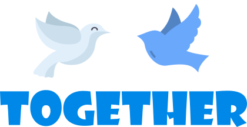

# Together-Web

Nosso objetivo é diminuir o espaço entre doadores e arrecadadores e assim mudar a vida de cada vez mais pessoas.

##O projeto está sendo desenvolvido utilizando Typescript, Node.js/Express, Knex como Query Builder e React.js
